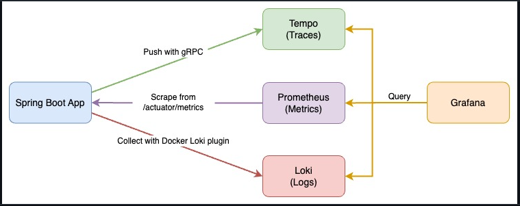

HT_REPORTING_ENDPOINT=http://localhost:4317;HT_SERVICE_NAME=auto-demo-mdc-logger;JAVA_TOOL_OPTIONS=-javaagent:hypertrace-agent-1.3.13-all.jar;MANAGEMENT_METRICS_TAGS_APPLICATION=my-spring-boot-app;OTEL_EXPORTER_OTLP_ENDPOINT=http://localhost:4318;OTEL_METRICS_EXPORTER=none;OTEL_RESOURCE_ATTRIBUTES=compose_service=my-spring-boot-app;OTEL_SERVICE_NAME=auto-demo-mdc-logger
1. mvn clean package
2. docker build -t my-spring-boot-app .
3. docker-compose up -d 

## Observe the Spring Boot application with three pillars of observability on Grafana:
1. Traces with [Tempo](https://github.com/grafana/tempo) and [OpenTelemetry Instrumentation for Java](https://github.com/open-telemetry/opentelemetry-java-instrumentation)
2. Metrics with [Prometheus](https://prometheus.io/), [Spring Boot Actuator](https://docs.spring.io/spring-boot/docs/current/actuator-api/htmlsingle/), and [Micrometer](https://micrometer.io/)
3. Logs with [Loki](https://github.com/grafana/loki) and [Logback](https://logback.qos.ch/)

metric to trace: histogram_quantile(.99,sum(rate(http_server_requests_seconds_bucket{application="my-spring-boot-app", uri!="/actuator/prometheus"}[1m])) by(uri, le))
trace to log : traceId
log to trace : {compose_service="my-spring-boot-app"} |= `51269bb75eb932d5b3dc8f958f03064b`

